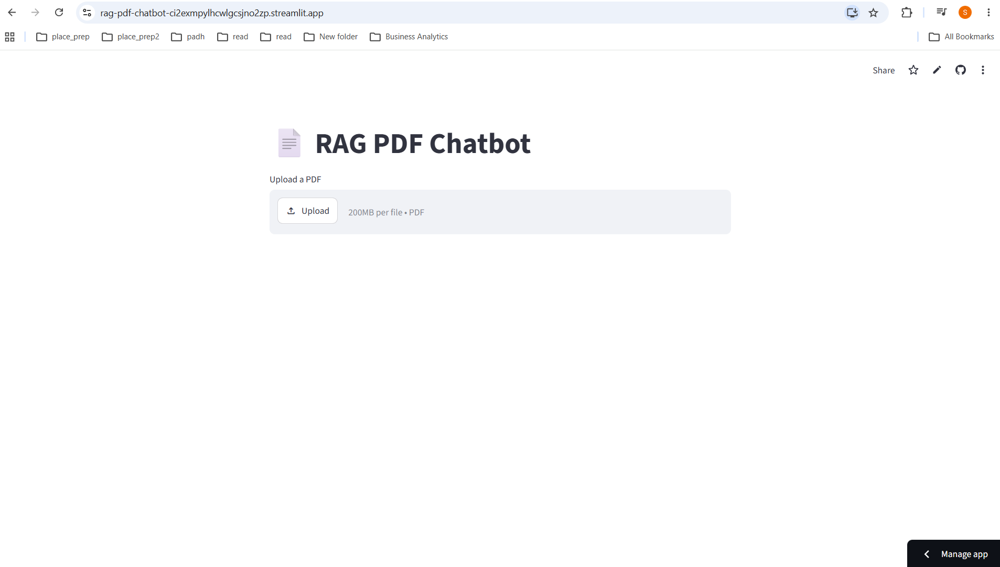
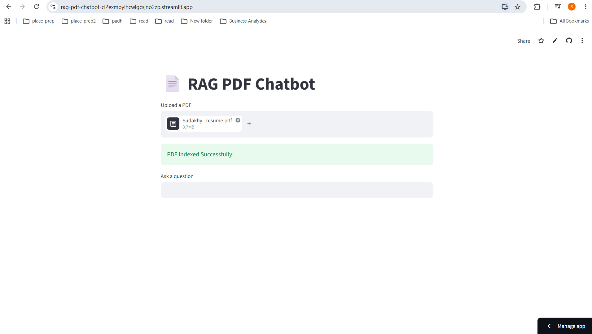
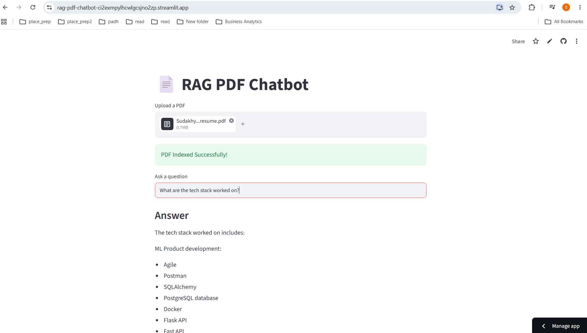

# 📄 RAG PDF Chatbot

An end-to-end Retrieval-Augmented Generation (RAG) application that allows users to upload PDF documents and ask natural language questions about their content using **Groq's Llama 3.3**, **LangChain**, **FAISS**, and **HuggingFace Embeddings**.

---

## 🚀 Live Demo

**Streamlit App:**  
https://rag-pdf-chatbot-ci2exmpylhcwlgcsjno2zp.streamlit.app/

---

## 📌 Features

- 📄 Upload PDF documents
- ✂️ Automatic text chunking
- 🔍 Semantic search using FAISS
- 🤖 Question Answering using Groq Llama 3.3
- ⚡ Fast inference with Groq API
- 🌐 Web interface built with Streamlit

---

## 🛠 Tech Stack

| Category | Technology |
|----------|------------|
| Language | Python |
| Framework | Streamlit |
| LLM | Groq Llama 3.3 |
| Framework | LangChain |
| Embeddings | sentence-transformers/all-MiniLM-L6-v2 |
| Vector Database | FAISS |
| PDF Parsing | PyPDFLoader |

---

## 🏗 Architecture

```
                PDF Upload
                     │
                     ▼
             PyPDFLoader
                     │
                     ▼
          Recursive Text Splitter
                     │
                     ▼
        HuggingFace Embeddings
                     │
                     ▼
             FAISS Vector Store
                     │
                     ▼
            Similarity Retrieval
                     │
                     ▼
              Groq Llama 3.3
                     │
                     ▼
              Generated Answer
```

---

## 📂 Project Structure

```
rag-pdf-chatbot/
│
├── assets/
│
├── src/
│   ├── pdf_loader.py
│   ├── vector_store.py
│   └── rag_chain.py
│
├── app.py
├── requirements.txt
├── README.md
├── .gitignore
└── .env (local only)
```

---

## ⚙️ Installation

Clone the repository

```bash
git clone https://github.com/YOUR_GITHUB_USERNAME/rag-pdf-chatbot.git
```

Go to the project folder

```bash
cd rag-pdf-chatbot
```

Create virtual environment

```bash
python -m venv .venv
```

Activate

Windows

```bash
.venv\Scripts\activate
```

Install dependencies

```bash
pip install -r requirements.txt
```

Create a `.env` file

```env
GROQ_API_KEY=your_api_key_here
```

Run the application

```bash
streamlit run app.py
```

---
## 📷 Demo

### Home Page



### Upload PDF



### Ask Questions


---

## 🔐 Environment Variables

This project requires a Groq API Key.

Create a `.env` file:

```env
GROQ_API_KEY=your_api_key_here
```

For Streamlit Cloud, add the same key under:

**Settings → Secrets**

```toml
GROQ_API_KEY="your_api_key_here"
```

---

## 🚀 Deployment

The application is deployed using **Streamlit Community Cloud**.

Simply connect the GitHub repository and add your `GROQ_API_KEY` under **Secrets**.

---

## 🌟 Future Improvements

- Multiple PDF support
- Chat history
- Source citations
- Persistent Vector Database
- Docker support
- Authentication
- Streaming responses
- Hybrid Search (BM25 + Vector Search)

---

## 👨‍💻 Author

**Sudakhya Nayak**

GitHub: https://github.com/YOUR_GITHUB_USERNAME

LinkedIn: (https://www.linkedin.com/in/sudakhya-nayak-998870124/)
